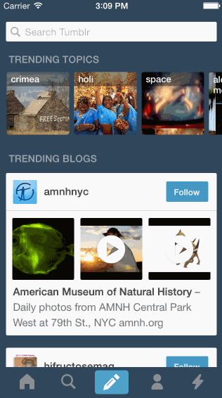

Week 4 Homework

#### How many hours to complete ?

    10 Hrs

#### Which required and optional stories have been completed ?

- Required:
    - (✓) Tab bar should be implemented as a view with 5 buttons.
    - (✓) Implement the 4 tabs (Home, Search, Account, and Trending) as scrollviews that contain screenshots.
        - Also added the Activity view
    - (✓) When not on the search tab, the explore popover should appear and bounce.
    - (✓) Tapping "Log in" from the Home page should show the login form.
    - (✓) Compose button should show the various post buttons without animation.
- Optional:
    - Try to imitate the animation effect of the real app.
    - Show the Tumblr loading graphic before showing the trending screen. Assets for the loading graphic are included.

#### Walkthrough

